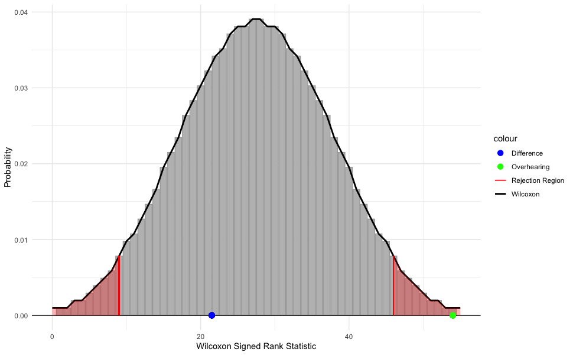
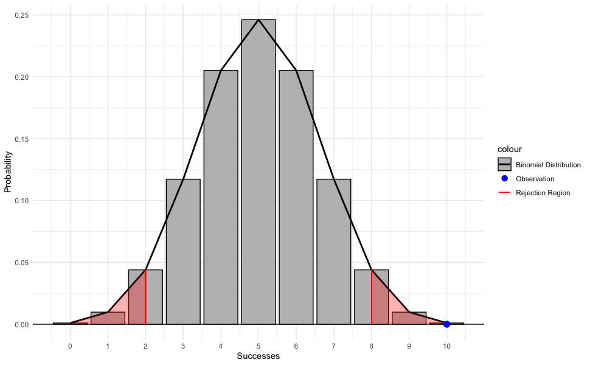
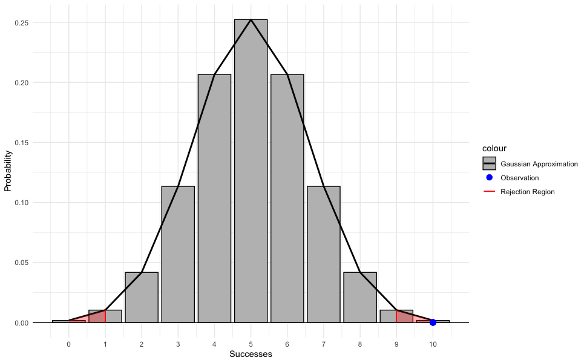

# Introduction

In this assignment we explore the idea of dogs learning the names of objects by overhearing the object being referenced in outside conversation without being directly taught. @dror2026dogs conducted a study where 10 dogs were exposed to a condition where two family members sitting across from each other passing the toy back and forth. The caretaker addressed the second person using simple sentence frames and non-verbal cues, neither directly to the dog.

# The Experiment

After 12 days of training the dogs they were tested to see if they could retrieve the toys when directed. For each dog the proportion of times they successfully retrieved a toy was recorded.

### Recorded Data

##### Overhearing

|   1 |   2 |    3 |   4 |      5 |      6 |    7 |      8 |      9 |  10 |
|----:|----:|-----:|----:|-------:|-------:|-----:|-------:|-------:|----:|
|   1 |   1 | 0.75 |   1 | 0.4167 | 0.8333 | 0.75 | 0.8333 | 0.8333 |   1 |

##### Paired Difference (Direct - Overhearing)

|       1 |   2 |       3 |       4 |      5 |      6 |    7 |      8 |   9 |      10 |
|--------:|----:|--------:|--------:|-------:|-------:|-----:|-------:|----:|--------:|
| -0.0833 |   0 | -0.0833 | -0.0833 | 0.5833 | 0.0833 | 0.25 | 0.1667 |   0 | -0.4167 |

### Data Summary

##### Overhearing

|   n |    mean |       sd | median |      IQR |
|----:|--------:|---------:|-------:|---------:|
|  10 | 0.84166 | 0.181931 | 0.8333 | 0.229175 |

##### Paired Difference

|   n |    mean |        sd | median |     IQR |
|----:|--------:|----------:|-------:|--------:|
|  10 | 0.04167 | 0.2613126 |      0 | 0.22915 |

# Testing

Looking at the data summaries, we can see that on average the dogs were able to retrieve the toys more than 50% of the time (not by chance), and that on average retrieved the toys successfully roughly the same amount of times as learning their names directly. Even though we can say that most of the dogs in the test are able to learn the names of objects from overhearing, is there enough data to make an inference on the greater population?

The possible one-sample tests we can consider are the Wilcoxon signed rank test, t-test, and z-test. Because of the small sample size ($n = 10$), the sample does not meet the normality assumption of any of the tests. Because of the robustness of the Wilcoxon signed rank test, however, I chose to perform this test instead of the others.

## Wilcoxon Signed Rank Test

I performed two two-sided Wilcoxon signed rank test with a confidence level of $95\%$ for the Overhearing data and Difference data. My hypotheses are below.

Overhearing Data:
$$
H_0 : \text{median}(X) = 50\% \newline
H_a : \text{median}(X) \neq 50\%
$$
Difference Data:
$$
H_0 : \text{median}(X) = 0 \newline
H_a : \text{median}(X) \neq 0
$$

### Test Results

|                    | Overhearing | Difference |
|-------------------:|------------:|-----------:|
| Wilcoxon Score     |  54.0000000 | 21.5000000 |
|   p-value          |   0.0074426 |  0.6705971 |

The $p$-value for the Overhearing data is less than $0.05$ so we have evidence to reject the null hypothesis, there is evidence that the dogs did not retrieve the correct toy by chance. The $p$-value for the Difference data is much greater than $0.05$, however, so we do not reject the null hypothesis, there is not sufficient evidence that the dogs retrieve the toys more or less successfully when learning their names directly or from overhearing.

::: {.columns}
::: {.column width="75%"}

:::
::: {.column width="25%"}
This graph shows the Wilcoxon distribution for a sample of size $n = 10$, along with the rejection region for a two-sided test ($\alpha = 0.05$). We can see that the Wilcoxon score for the Difference data ($W = 21.5$) lies near the middle of the distribution so we do not reject the null in this case. However, the Wilcoxon score for the Overhearing data ($W = 54.0$) lies far in the rejection region so we do reject the null.
:::
:::

## Binomial Test
### Trials and Conditions
@dror2026dogs performed two new-toy trials per dog, still $n=10$, and each dog chose the correct toy on the first try for each trial. The researchers assume that the probability that the dog chooses the new toy by chance is $50\%$.

For us to consider the binomial distribution to represent this data we must meet the $4$ conditions of using the binomial distribution: Binary outcomes, Independent trials, Number of trials fixed, and Same probability of success (BINS). The possible outcomes of the performed trials are either the dog successfully chooses the new toy ($1$) or they do not ($0$), so the binary condition is met. The trials are independent and performed on separate dogs so the independence condition is met. The number of trials is fixed ($n=10$) and each trial is assumed to have the same probability of success ($50\%$). Since all conditions are met for the binomial distribution it makes sense to do a binomial test on this data.

### Exact Binomial Test

For this test the data used was number of successes $x=10$ and number of trials $n=10$. When performing this test the researchers assume that the population parameter, the probability a dog will choose the correct toy the first time, is $p=50\%$. Below are my hypotheses:

$$
H_0:  p = 50\% \newline
H_a: p \neq 50\%
$$

:::{.columns}
:::{.column width="75%"}

:::
:::{.column width="25%"}
From this graph we can see the binomial distribution for random variable with probability $p=0.5$ and $n=10$ trials. For a two-sided test with a confidence level of $95\%$ the rejection region falls on the interval $0\leq x\geq 2$ and $8\leq x\geq 10$. The observation made by researchers, $x=10$, is the maximum possible observation and lies on the farthest end of the rejection region, indicating a low probability of being observed if the population parameter $p$ is actually $50\%$.
:::
:::

#### Test Results

After performing the exact binomial test on the data with a confidence level of $95\%$, the probability of observing $10$ successes out of $10$ trials is $\approx0.00195$. Since the observed $p$-value is much less than $\alpha = 0.05$, we can reject the null hypothesis and say that there is statistically discernible evidence that the probability of the dogs choosing the correct toy on the first try is not $50\%$.

### Gaussian Approximation of Binomial Distribution

For sufficiently large samples, $n\geq30$, we can use the Gaussian approximation of the binomial distribution changing the parameters to:

$$
n = 10, p = 0.5 \newline
\mu_0 = np, \sigma_0=\sqrt{(np(p-1))}
$$

:::{.columns}
:::{.column width="75%"}

:::
:::{.column width="25%"}
The Gaussian approximation looks very similar to the exact distribution, but there are slight differences. Because the sample size is small and this model is just an approximation, the rejection region begins at a decimal value, however our data is discrete so I rounded towards the edges of the distribution for the rejection region. Even with this smaller rejection region, however, the result is the same, the observation of $100\%$ successes is in this region.
:::
:::

#### Test Results

Calculating the probability of the researchers' observation using the approximate distribution yielded a $p$-value of $\approx0.00443$. Even though the approximated $p$-value is more than $2\times$ larger than the exact ($\approx0.00195$), the conclusion of the tests are the same: reject the null.

### Inference

In the case of this specific experiment where all trials were successes, I think it is fair to make an inference based on the tests performed due to how low the $p$-values are. Both the exact binomial test and the Gaussian approximation produce $p$-values well below the significance level of $\alpha = 0.05$, providing strong evidence against the null hypothesis that the probability of a successful trial is $p = 0.5$. Therefore, the null hypothesis can be rejected in favor of the conclusion that the probability of success differs from chance. Although the Gaussian approximation produces a larger $p$-value than the exact binomial test, both methods lead to the same statistical conclusion. The difference between the two $p$-values is likely due to the small sample size ($n=10$) and the observed result being at the extreme end of the distribution. For this reason, the exact binomial test provides the more reliable inference for these data.